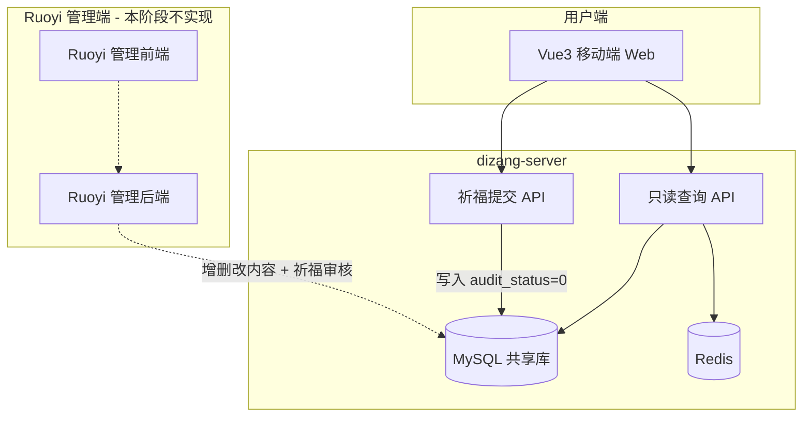
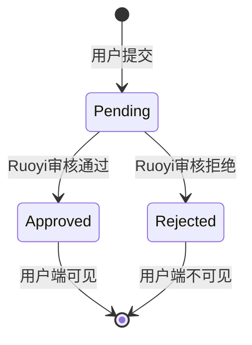

# 学佛网站 — 项目规划

## 已确认需求

- **无需登录**：游客浏览全部内容，祈福墙匿名发布
- **内容以图文为主**：音频/视频为辅（梵音模块除外）
- **全部内容由 Ruoyi 管理后台添加**：经典、开示、专题、知识、梵音、Banner 等均由 Ruoyi 写入，**dizang-server 不做内容写接口**
- **祈福墙需 Ruoyi 后台审核**：用户提交后默认待审，审核通过才在用户端展示
- **Ruoyi 后台具体实现**：本阶段不做，等你导入框架后再规划
- **移动端优先**：屏幕适配手机端，PC 端内容区居中限宽

---

## 整体架构



**职责划分**：

| 系统 | 职责 |
|---|---|
| dizang-web | 移动端展示、祈福提交 |
| dizang-server | 内容只读 GET + 祈福 POST（待审） |
| Ruoyi（后续） | 全部内容 CRUD、文件上传、祈福审核 |

### 项目目录

```
Dizang/
├── dizang-web/       # Vue 3 用户端前端
├── dizang-server/    # Spring Boot 用户端后端
├── docs/             # 规划、表结构、API 文档
└── (后续) ruoyi/     # 你导入 Ruoyi 后放置
```

---

## 技术选型

### 用户端前端 dizang-web

| 项 | 选型 |
|---|---|
| 框架 | Vue 3 + Vite + TypeScript |
| 路由/状态 | Vue Router 4 + Pinia |
| UI | Vant 4（移动端） |
| HTTP | Axios |
| 富文本 | v-html + DOMPurify |
| 音频 | HTML5 Audio + 自定义播放器 |
| 适配 | 375px 设计稿 vw 适配；PC max-width 480px 居中 |

**底部 Tab**：首页 | 经典 | 梵音 | 祈福墙

### 用户端后端 dizang-server

| 项 | 选型 |
|---|---|
| 框架 | Spring Boot 3 + Java 17 |
| ORM | MyBatis-Plus |
| 数据库 | MySQL 8 |
| 缓存 | Redis |
| 文档 | Knife4j |
| 职责 | **仅用户端 API**，不实现 admin 写接口 |

开发阶段用 SQL 脚本插入测试数据（模拟 Ruoyi 写入）。

---

## 六大功能模块

| 模块 | 用户端功能 | 内容来源 |
|---|---|---|
| 佛学经典 | 列表 / 目录 / 章节阅读 | Ruoyi 维护 classic + classic_chapter |
| 大德开示 | 列表 / 详情 | Ruoyi 维护 master + teaching |
| 专题 | 九宫格 / 文章列表 / 详情 | Ruoyi 维护 topic + article |
| 佛教知识 | 分类 / 列表 / 详情 | Ruoyi 维护 knowledge_category + knowledge |
| 梵音 | 列表 / 播放器 | Ruoyi 维护 audio + audio_category |
| 祈福墙 | 发布 / 列表 / 点赞 | 用户提交 + Ruoyi 审核 |

### 九大专题（固定种子数据）

1. 精进念佛
2. 深信因果
3. 戒杀放生
4. 消除业障
5. 禅定
6. 贪嗔痴慢疑
7. 素食
8. 往生西方
9. 积德改命

---

## 数据库设计（Ruoyi 兼容）

### 所有内容表通用字段

每张业务表必含，方便 Ruoyi 代码生成器对接：

| 字段 | 类型 | 说明 |
|---|---|---|
| create_by | varchar(64) | 创建者 |
| create_time | datetime | 创建时间 |
| update_by | varchar(64) | 更新者 |
| update_time | datetime | 更新时间 |
| status | char(1) | 0=正常(上架) 1=停用(下架)，用户端只查 status=0 |
| del_flag | char(1) | 0=存在 2=删除（Ruoyi 逻辑删除惯例） |
| remark | varchar(500) | 备注（可选） |

### 业务表清单

| 表名 | 说明 |
|---|---|
| banner | 首页轮播 |
| classic | 佛学经典 |
| classic_chapter | 经典章节（树形，sort_order） |
| master | 大德/法师 |
| teaching | 大德开示文章 |
| topic | 九大专题 |
| article | 专题文章（type 区分类型） |
| knowledge_category | 佛教知识分类 |
| knowledge | 佛教知识文章 |
| audio_category | 梵音分类 |
| audio | 梵音（file_url, duration, play_count） |
| blessing | 祈福墙 |

### 祈福墙 blessing 表（审核为核心）

| 字段 | 类型 | 说明 |
|---|---|---|
| id | bigint PK | 主键 |
| nickname | varchar(50) | 昵称，默认「匿名善信」 |
| content | varchar(200) | 祈福内容 |
| like_count | int | 点赞数 |
| audit_status | tinyint | **0=待审核 1=已通过 2=已拒绝** |
| audit_by | varchar(64) | 审核人（Ruoyi 用户名） |
| audit_time | datetime | 审核时间 |
| reject_reason | varchar(200) | 拒绝原因（可选） |
| ip_hash | varchar(64) | 提交 IP 哈希，防刷 |
| create_time | datetime | 提交时间 |
| del_flag | char(1) | 逻辑删除 |

**审核流转**：



**内容表 vs 祈福墙**：

| 对比 | 内容表 | blessing |
|---|---|---|
| 写入方 | Ruoyi 管理员 | 用户端匿名 |
| 状态字段 | status（上下架） | audit_status（审核） |
| 用户端 API | 只读 GET | GET(已通过) + POST(待审) |

---

## API 设计（dizang-server 仅用户端）

前缀 `/api/v1`，所有内容查询统一过滤 `status=0 AND del_flag=0`。

| 模块 | 接口 | 说明 |
|---|---|---|
| 首页 | GET /home | banner + 推荐 + 模块入口 |
| 经典 | GET /classics | 经典列表 |
| 经典 | GET /classics/{id} | 经典详情+目录 |
| 经典 | GET /classics/{id}/chapters/{chapterId} | 章节正文 |
| 开示 | GET /teachings, /teachings/{id}, /masters | 开示列表/详情/大师 |
| 专题 | GET /topics, /topics/{id}/articles, /articles/{id} | 专题与文章 |
| 知识 | GET /knowledge/categories, /knowledge, /knowledge/{id} | 佛教知识 |
| 梵音 | GET /audios, /audios/{id} | 梵音列表/详情 |
| 梵音 | POST /audios/{id}/play | 播放计数 |
| 祈福墙 | GET /blessings | 仅 audit_status=1 |
| 祈福墙 | POST /blessings | 写入 audit_status=0，返回待审提示 |
| 祈福墙 | POST /blessings/{id}/like | 仅已通过可点赞 |
| 搜索 | GET /search?q= | 全站搜索 |

**本阶段不实现**（全部留给 Ruoyi）：内容 CRUD、文件上传、祈福审核。

---

## 前端路由

```
/                          首页
/classics                  经典列表
/classics/:id              经典目录
/classics/:id/:chapterId   章节阅读
/teachings                 大德开示列表
/teachings/:id             开示详情
/topics                    专题九宫格
/topics/:id                专题文章列表
/articles/:id              文章详情
/knowledge                 佛教知识
/knowledge/:id             知识详情
/audios                    梵音列表
/audios/:id                梵音播放
/blessings                 祈福墙
/search                    搜索
```

---

## UI/UX 方向

- 色调：米白/宣纸色背景 + 朱砂红/金色点缀 + 深褐文字
- 字体：标题宋体/楷体，正文系统 sans-serif
- 阅读页：字号三档、夜间模式（localStorage）
- 性能：图片懒加载、路由懒加载

---

## 实施阶段

### 阶段一：基础脚手架（1-2 天）

- 初始化 dizang-web（Vue3 + Vant + 移动端适配）
- 初始化 dizang-server（Spring Boot + MyBatis-Plus + MySQL + Redis）
- 建表 + 九大专题种子数据

### 阶段二：内容模块（3-4 天）

- 只读 API + 首页/经典/开示/专题/知识前端
- SQL 脚本灌测试数据

### 阶段三：梵音 + 祈福墙（2 天）

- 梵音播放器
- 祈福提交/列表/点赞/防刷 + 待审提示

### 阶段四：完善（1-2 天）

- 全站搜索、SEO、部署配置
- 输出 docs/database-schema.md 供 Ruoyi 对接

---

## Ruoyi 衔接（本阶段只设计，不实现）

导入 Ruoyi 后单独规划：

1. **共用 MySQL 库**，Ruoyi 直接读写业务表
2. 表结构已含 Ruoyi 通用字段，可用代码生成器
3. Ruoyi 需实现：全部内容 CRUD、文件上传、祈福审核（待审/通过/拒绝）
4. dizang-server 不加 admin 接口

---

## 风险与注意事项

- 祈福防刷：验证码 + IP 限频 + 敏感词 + Ruoyi 人工审核
- 富文本 XSS：DOMPurify + 后端白名单标签
- 音频/图片：Ruoyi 上传走 OSS/CDN，用户端只读 URL
- 版权：经典、开示、梵音需确认授权
